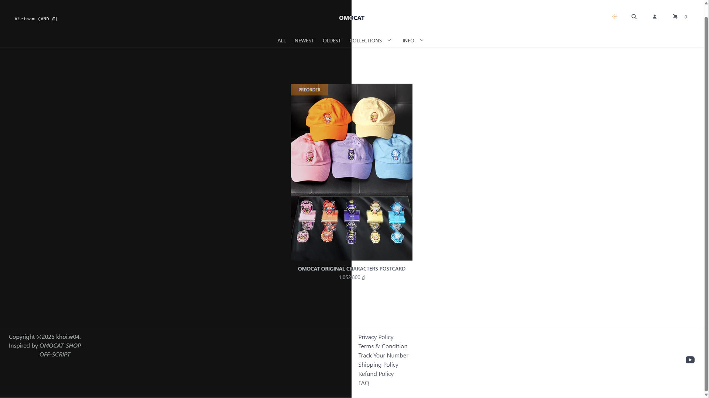
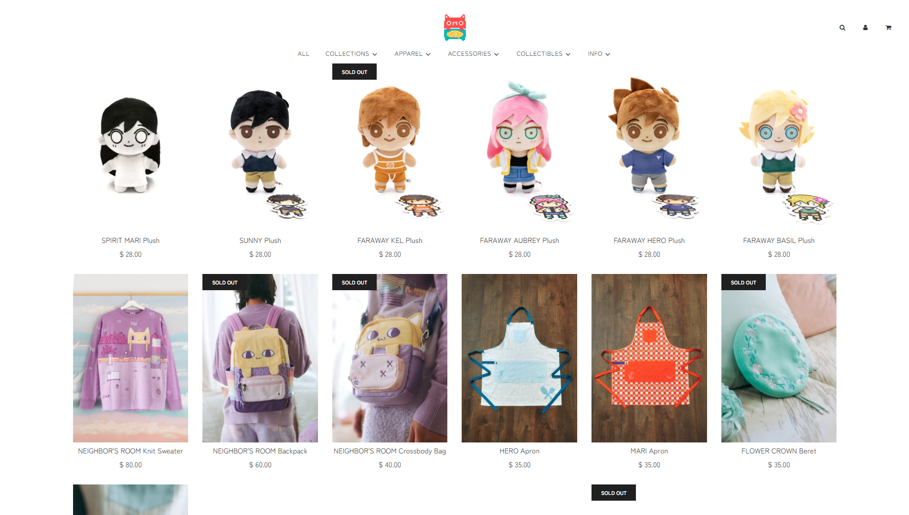
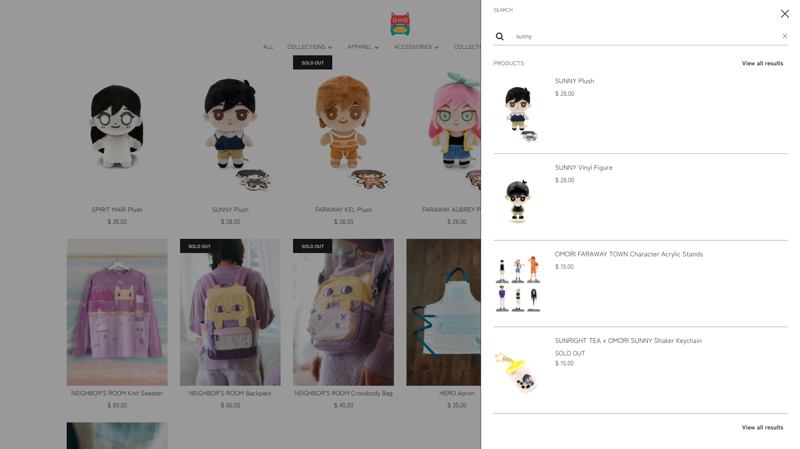
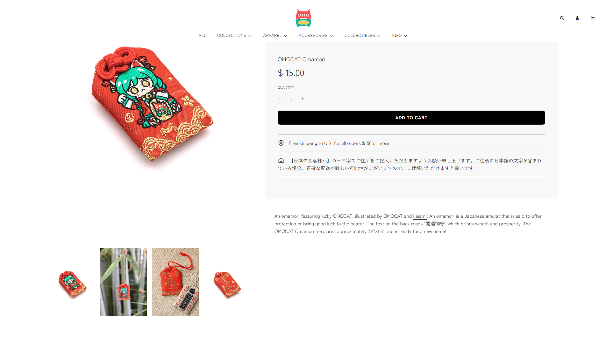
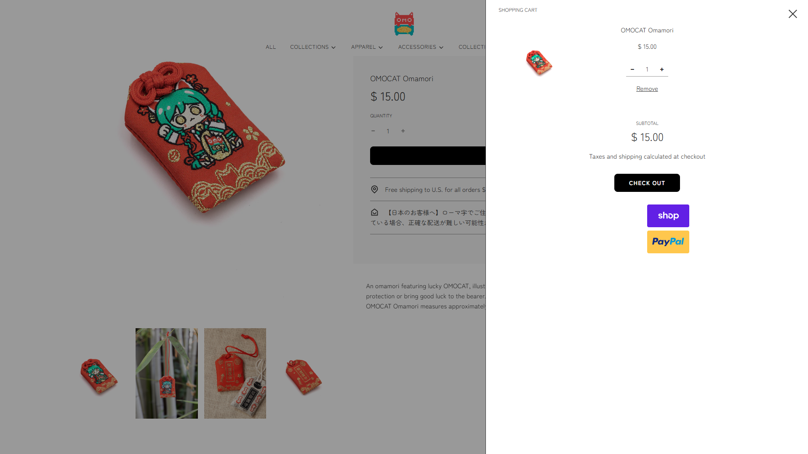

## Meaning

["OMOCAT Shop"]("https://www.omocat-shop.com/) is an independent fashion brand based in Los Angeles,
known for its bold fusion of anime aesthetics, pixel art,
and streetwear culture. Founded by the artist OMOCAT,
the brand has built a passionate global following through
its expressive designs and collaborations with iconic names in pop culture.

OMOCAT has partnered with:

- Sameko Saba

- Sunright Tea Studio

- hololive Production

- Pokémon

- Doki Doki Literature Club!

These collaborations have resulted in exclusive merchandise that blends fan culture with high-quality design.

## Highlights

<video width="1280" height="720" loop autoPlay muted>
  <source src="/assets/scrollgallery.mp4" type="video/mp4" />
</video>

## Stacks

| Category  | Technologies Used     |
| --------- | --------------------- |
| Front-end | Tanstack Start, React |
| Back-end  | Supabase, Bun, Stripe |
| Styling   | Tailwind CSS          |
| Animation | Framer Motion         |
| Language  | TypeScript            |

## Inspirations

Inspirations by [OMOCAT](https://www.omocat-shop.com/)
