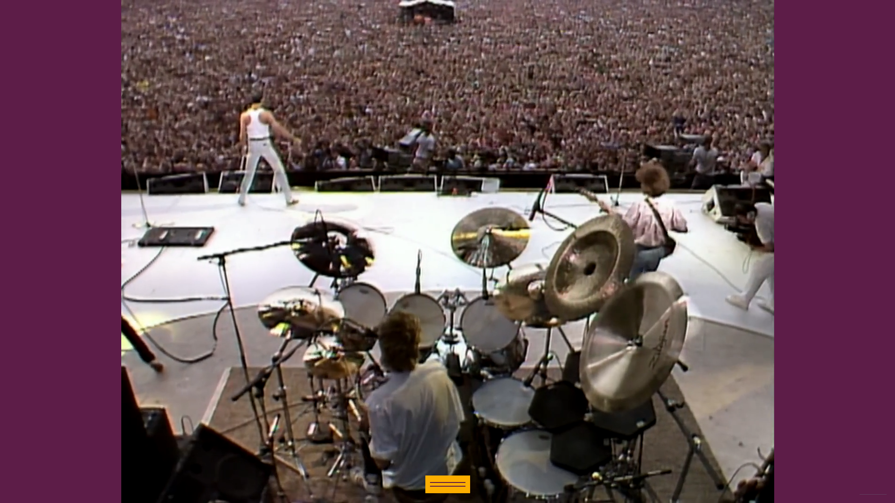
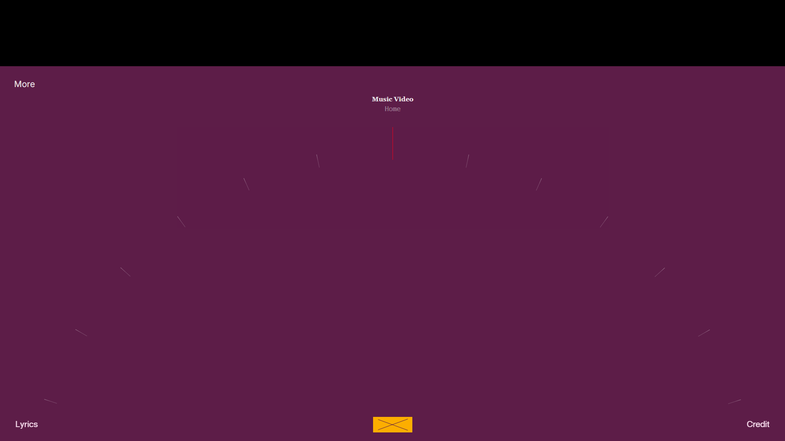
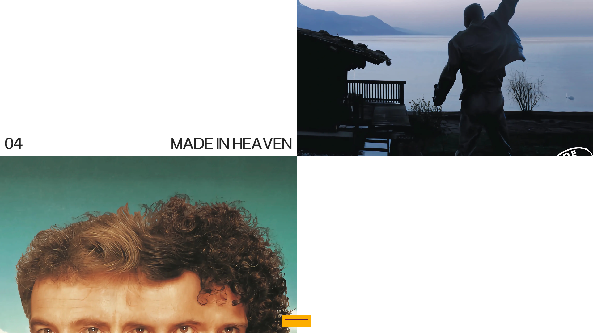
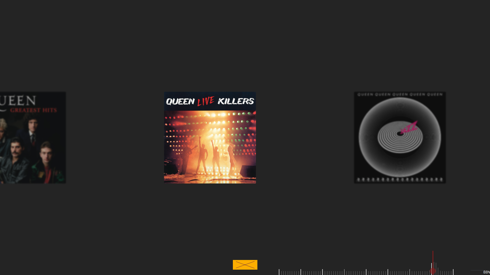
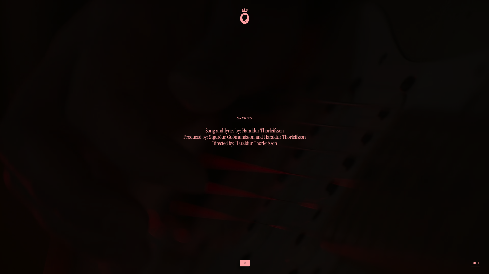
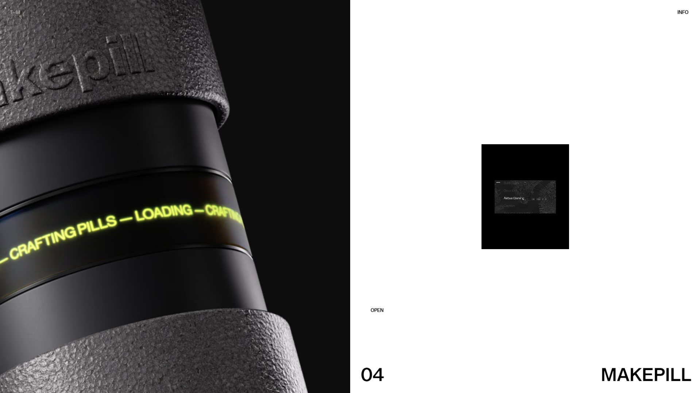
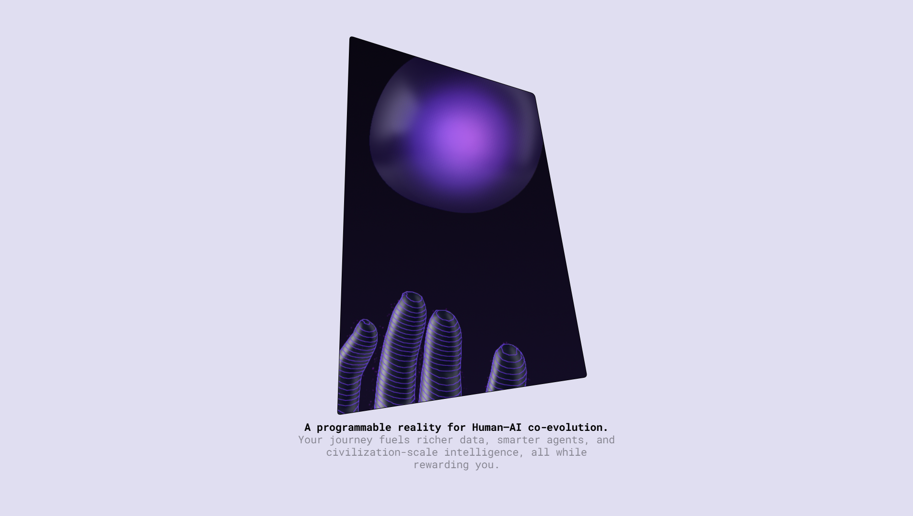
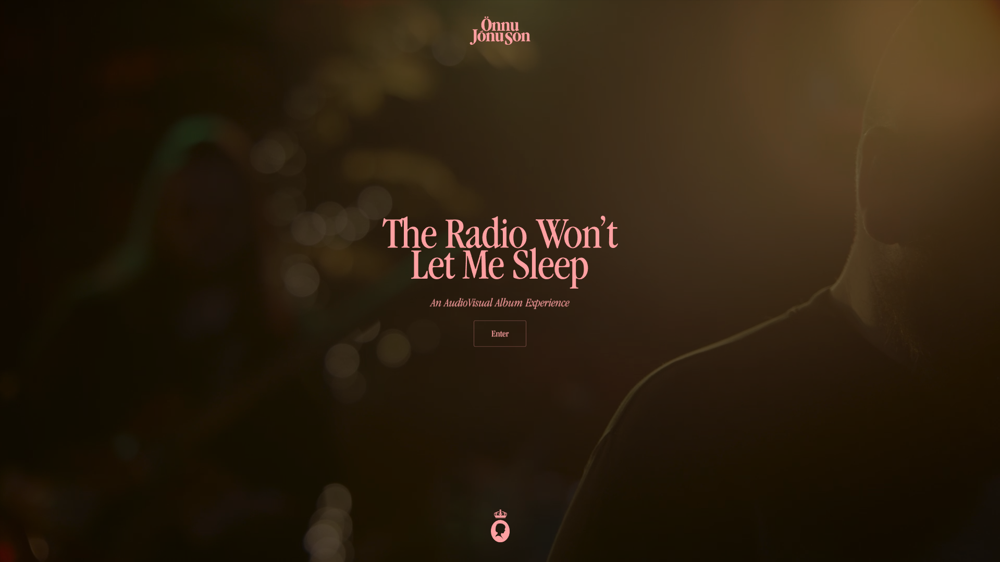

## Meaning
["Radio Ga Ga"](https://youtu.be/o-0ygW-B_gI?si=bZY_Tg1uzJKyUn8-) is a 1984 song by the British rock band Queen, written by their drummer Roger Taylor.
A nostalgic defence of radio, it was a commentary on television overtaking radio's popularity and how one would listen to radio in the past for a favourite comedy, drama, or science fiction programme.

## Reasons
I choose this song because of the catchy title. I have also been following Queen for 1 year. Combining these two reasons, that is why I choose this song for my work.

## Highlights

## Stacks
| Category     | Technologies Used        |
|--------------|--------------------------|
| Framework    | Vite, React              |
| Styling      | Tailwind CSS             |
| Animation    | Framer Motion            |
| Language     | TypeScript               |

## Inspirations

<video loop autoPlay muted>
  <source src="https://cdn.rauno.me/run4.mp4#t=0.01" type="video/mp4" />  
</video>

<video loop autoPlay muted>
  <source src="https://cdn.rauno.me/wheel.mp4#t=0.01" type="video/mp4" />  
</video>

<video loop autoPlay muted>
  <source src="https://cdn.rauno.me/waveform.mp4#t=0.01" type="video/mp4" />  
</video>

Thanks to [Önnu Jónu Son](https://onnujonuson.com/), [Rauno](https://rauno.me/craft), [Zentry](https://zentry.com/), [Thomas Monavon](https://www.thomasmonavon.com/)